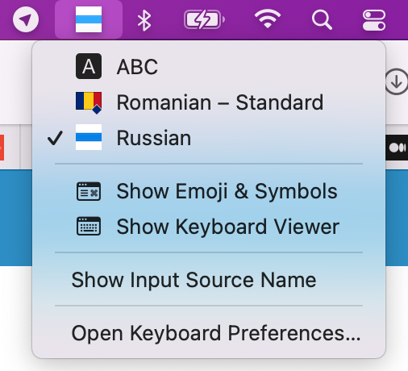
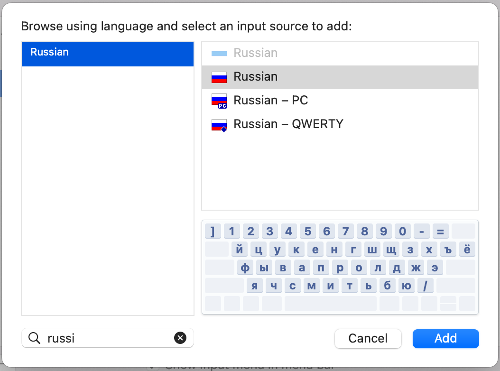

# russian_layout
macOS Russian keyboard layout

## Install
1. Put the russian.bundle file into ~/Library/Keyboard Layouts .
2. Restart the computer.
3. Add the correct layout from "System Preferences > Keyboard > Input Sources".

